# Sodaholic

A mobile app for tracking your soda and carbonated drink consumption — because someone has to.

> Almost all of the icons and UI artwork in this app were hand-drawn by me.

<p align="center">
  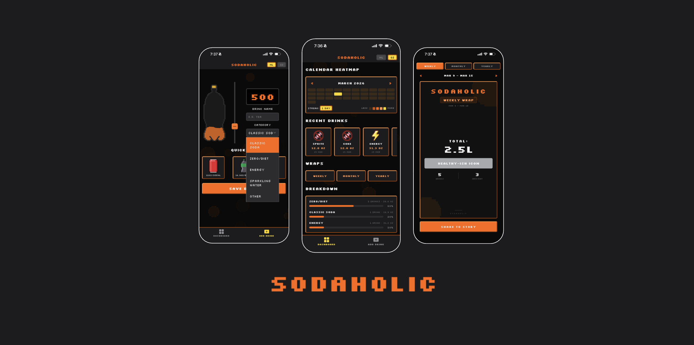
</p>

<p align="center">
  
</p>

---

## What it does

Sodaholic lets you log every can, bottle, and glass of soda you drink, then gives you stats and summaries to reflect on your choices.

**Your data never leaves your device.** The app is fully local-first — everything is stored on-device using SQLite. No accounts, no servers, no tracking, no analytics.

---

## Screens

### Dashboard

The home screen at a glance:

- **Calendar heatmap** — a month view where each day is color-coded by how many drinks you logged. Navigate between months with swipe gestures. Includes a streak counter for consecutive days with drinks.
- **Recent drinks** — a horizontal scrollable list of your last 10 logged drinks, with category icons and delete support.
- **Category breakdown** — a bar chart showing your drink distribution by category (count and percentage).
- **Wrap buttons** — quick links to your weekly, monthly, and yearly summaries.
- **Recap banner** — appears when a new wrap is available to view.

<p align="center">
  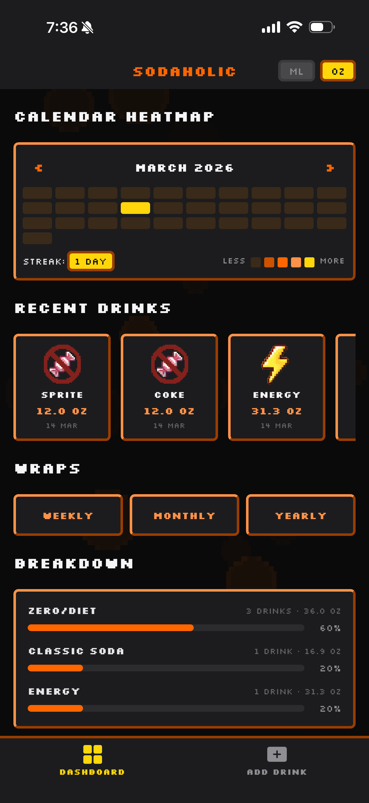
</p>

---

### Add Drink

The logging screen:

- **Animated bottle** — a Skia canvas-rendered bottle that fills up with a wave animation as you adjust the volume.
- **Vertical slider** — drag to set volume anywhere from 0 to 2000ml.
- **Quick-add buttons** — presets for common sizes: 355ml (12oz), 500ml (16.9oz), and 2L.
- **Drink name** — text input with a 20-character limit.
- **Category selector** — choose from 5 categories: Classic Soda, Diet/Zero, Energy, Sparkling Water, Other.
- **Unit toggle** — switch between ml and oz at any time.

<p align="center">
  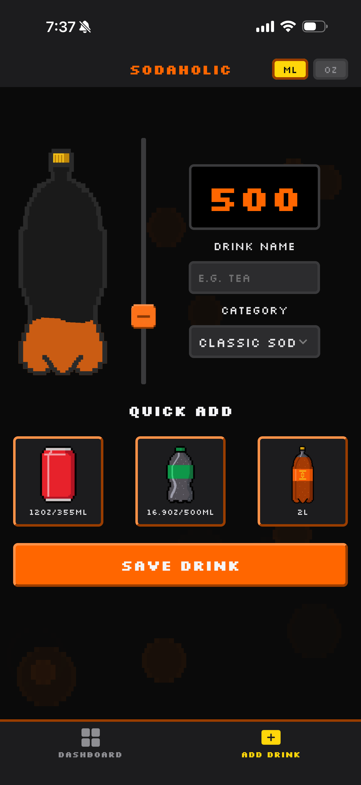
  &nbsp;&nbsp;
  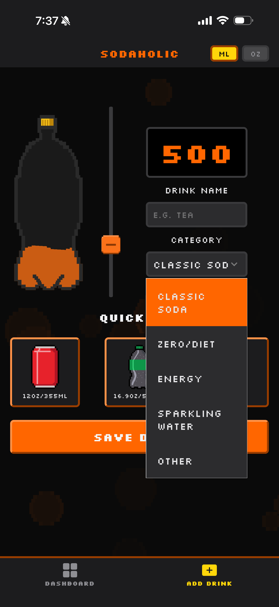
  &nbsp;&nbsp;
  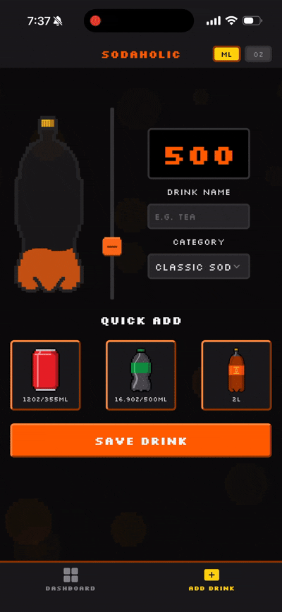
</p>

---

### Wraps (Weekly / Monthly / Yearly)

A full-screen summary modal that recaps your consumption over a period:

- Switch between weekly, monthly, and yearly tabs.
- Navigate backward and forward through past periods.
- Each wrap card shows:
  - Total volume consumed
  - Number of drinks logged
  - Your top category, with a humorous auto-generated title (e.g. *"Caffeine Criminal"*, *"Spicy Water Enthusiast"*)
- **Share button** — captures the card as an image and opens the native share sheet.

<p align="center">
  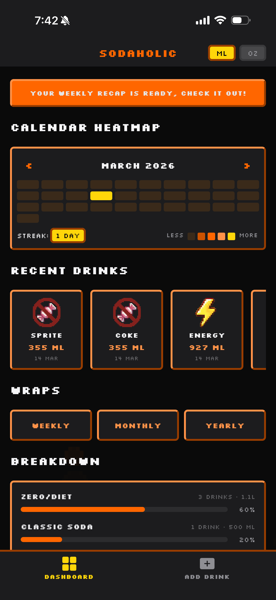
  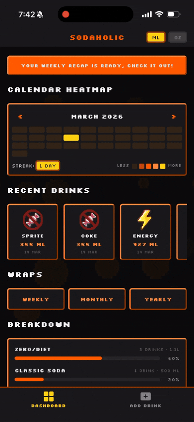
  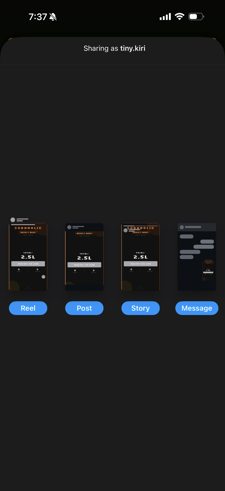
  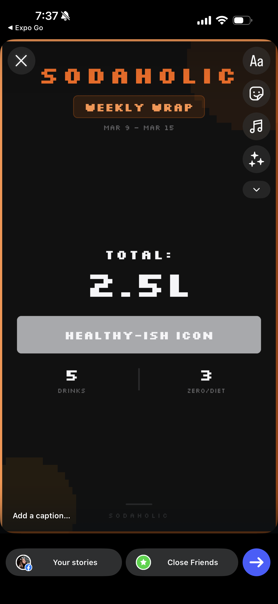
</p>

---

## Categories

| Icon | Category | Color |
|------|----------|-------|
|  | Classic Soda | Red |
| 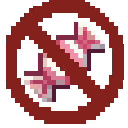 | Diet / Zero | Gray |
|  | Energy | Green |
|  | Sparkling Water | Cyan |
| 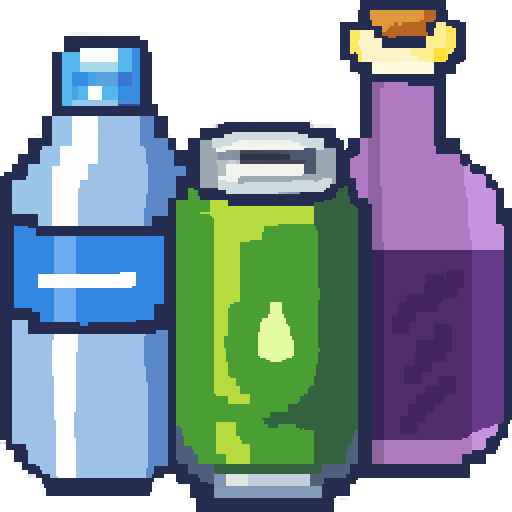 | Other | Orange |

---

## Privacy

Sodaholic collects no data whatsoever. There are no accounts, no analytics, no crash reporting, and no network requests. Everything you log stays on your device in a local SQLite database. Uninstalling the app deletes everything.

---

## Tech Stack

- **React Native 0.81** + **Expo 54**
- **Expo Router** — file-based navigation
- **TinyBase** — reactive data store, persisted to **SQLite** via Expo SQLite
- **@shopify/react-native-skia** — canvas rendering for the bottle and bubble animations
- **React Native Reanimated** — smooth UI animations
- **Silkscreen** — custom retro pixel font

---

## Running locally

```bash
npm install
npx expo start
```

Open in an iOS simulator, Android emulator, or on-device with Expo Go.

---

## Art & Icons

Almost all of the icons and visual assets in this app — category icons, drink illustrations, and UI decorations — were **drawn by me**.
